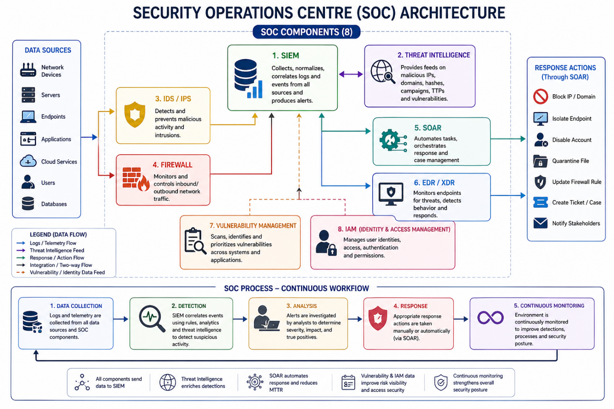

# Task 1: SOC Architecture Design

**Part of:** IT8510 Threat Intelligence & Threat Hunting — Group Project (Part A, Task 1)
**My contribution:** Full design of the SOC architecture, component integration, workflow, and roles.

## Objective

Design a comprehensive Security Operations Centre (SOC) architecture integrating key components, processes, and roles to support monitoring, detection, analysis, and response to cyber threats.

## Architecture Diagram

## Design Overview

The architecture integrates **8 SOC components** around a central SIEM hub:

- **SIEM** — collects, normalizes, and correlates logs and events from every connected source, producing alerts.
- **Threat Intelligence** — feeds the SIEM with data on known malicious IPs, domains, hashes, campaigns, and TTPs to enrich detections.
- **IDS/IPS** — inspects network traffic and blocks malicious activity in real time.
- **Firewall** — controls inbound/outbound traffic at the network boundary.
- **SOAR** — orchestrates and automates response actions, reducing mean time to respond.
- **EDR/XDR** — monitors endpoint behavior and detects and responds to threats at the host level.
- **Vulnerability Management** — scans, identifies, and prioritizes system weaknesses.
- **IAM** — manages identities, authentication, and access permissions.

All 8 components feed data into the SIEM (blue arrows), threat intelligence enriches detection (purple), and confirmed threats trigger response actions through SOAR (green) — including blocking IPs/domains, isolating endpoints, disabling accounts, quarantining files, updating firewall rules, and notifying stakeholders.

## SOC Workflow

A continuous 5-stage loop:

**Data Collection → Detection → Analysis → Response → Continuous Monitoring**

1. **Data Collection** — logs and telemetry pulled from all sources into the SIEM.
2. **Detection** — the SIEM correlates events using rules, analytics, and threat intelligence to flag suspicious activity.
3. **Analysis** — analysts investigate alerts to determine severity, impact, and whether they are true positives.
4. **Response** — appropriate action is taken, manually or automatically via SOAR.
5. **Continuous Monitoring** — the environment is continuously monitored to refine detections and improve overall security posture.

## SOC Roles Defined

| Role | Responsibility |
|------|-----------------|
| **SOC Analyst (L1/L2/L3)** | Monitors, investigates, and escalates alerts |
| **Incident Responder** | Contains and remediates active incidents, performs root-cause and forensic analysis, restores systems |
| **Threat Hunter** | Proactively searches for hidden or undetected threats |
| **SOC Manager** | Oversees SOC operations, ensures policy compliance, leads the team, drives process improvement |
| **Threat Intelligence Analyst** | Supplies intelligence that strengthens detection and response |

## Design Rationale

- **SIEM + Threat Intelligence as mandatory anchors**: every other component's output is only actionable once correlated (SIEM) and contextualized (TI) — placing them at the center reflects how detections actually get triaged.
- **SOAR as the single response chokepoint**: rather than each component reacting independently, routing all confirmed detections through SOAR keeps response actions consistent, auditable, and reduces the chance of conflicting manual actions.
- **Two-way arrows between SIEM and TI**: SIEM queries TI feeds to enrich alerts, and can also push observed indicators back for correlation — this bidirectional link is what turns raw logs into actionable intelligence in practice, and it's the connection I implemented directly in Task 2 (VirusTotal integration).
