# Task 2: XDR Detection & Automated Response (Wazuh)

**Part of:** IT8510 Threat Intelligence & Threat Hunting — Group Project (Part B, Task 2)
**My contribution:** Simulated 3 distinct attacks, wrote custom Wazuh detection rules for each, and configured automated active responses.

## Objective

Implement Extended Detection and Response (XDR) using Wazuh: detect three different cyber threats, configure detection rules for each, and execute an automated response action per attack — with evidence of detection, rule config, and successful response.

| Attack | Technique | Detection | Response |
|---|---|---|---|
| 1. SSH Brute Force | Medusa credential attack | Custom frequency rule on repeated auth failures | Auto-block attacker IP (`firewall-drop`) |
| 2. Port Scan | Nmap SYN scan | Two-stage escalation rule on UFW block events | Auto-block source IP via `firewall-drop` |
| 3. Malware Drop | EICAR test file | FIM (syscheck) + VirusTotal hash lookup | Auto-delete malicious file via custom Python script |

---

## Attack 1 — SSH Brute Force

**Setup:** Kali Linux attacking a Bodhi Linux Wazuh agent using Medusa with username/password lists over SSH.

```
medusa -h 192.168.56.104 -U users.txt -P passwords.txt -M ssh
```

This generates repeated failed-authentication events in `/var/log/auth.log`, forwarded to the Wazuh manager via the agent's log collection config.

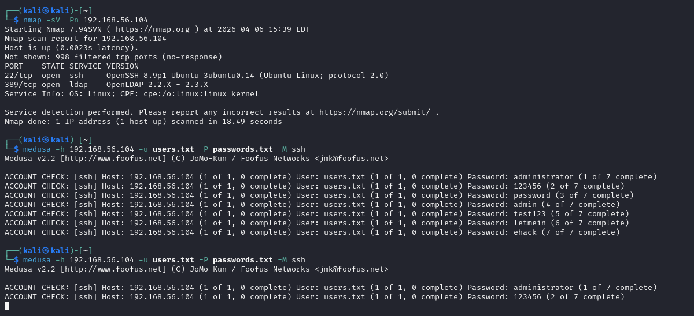

**Detection rule:** built on top of Wazuh's default rule 5710 (failed SSH login), a custom rule escalates repeated failures into a brute-force detection:

- `if_matched_sid: 5710` — triggers only on existing SSH-failure events
- `frequency: 5`, `timeframe: 60` — 5 failures within 60 seconds
- `same_source_ip` — all attempts must come from the same IP, to avoid false positives

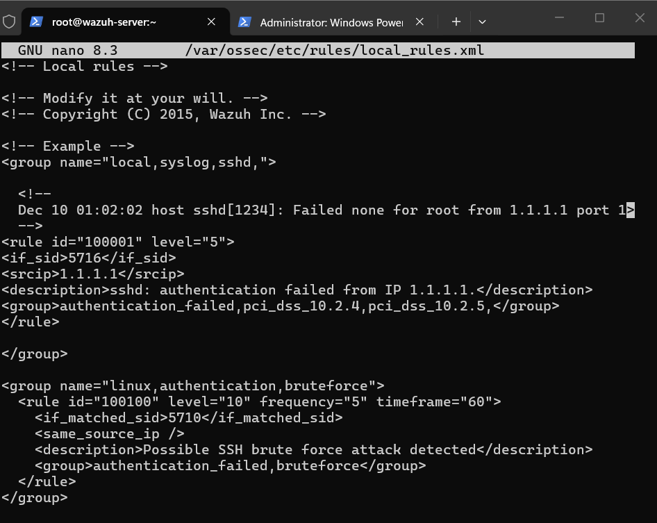

**Response:** Wazuh's built-in `firewall-drop` active response is triggered by the custom rule and blocks the attacker's IP via `iptables` for 180 seconds.

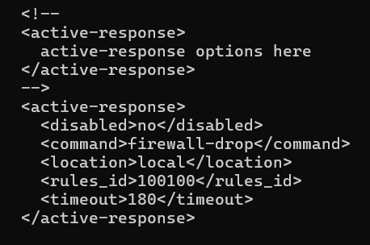

**Validation:** re-running the attack confirms rule 5710 and 100100 both fire, and the attacker IP is then unreachable.

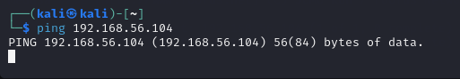

---

## Attack 2 — Port Scan Detection

**Setup:** UFW was installed and enabled on the Bodhi Linux agent to log/block unsolicited inbound traffic, with its logs forwarded to Wazuh. Kali then ran a full SYN stealth scan:

```
sudo nmap -sS -T4 -p- 192.168.56.104
```

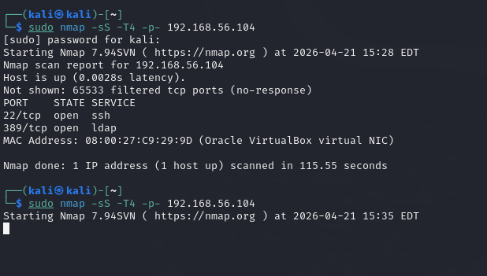

**Detection rule — two-stage escalation:**

- **Rule 100199** (level 5): fires on every individual `UFW BLOCK` log line from the kernel — low severity on its own.
- **Rule 100200** (level 12): escalation rule — fires when **5+ rule-100199 events from the same source IP occur within 60 seconds**, which is the signature of scanning behavior rather than one blocked packet.

This two-stage design avoids reacting to every dropped packet (high false-positive risk) while still catching genuine scan patterns quickly.

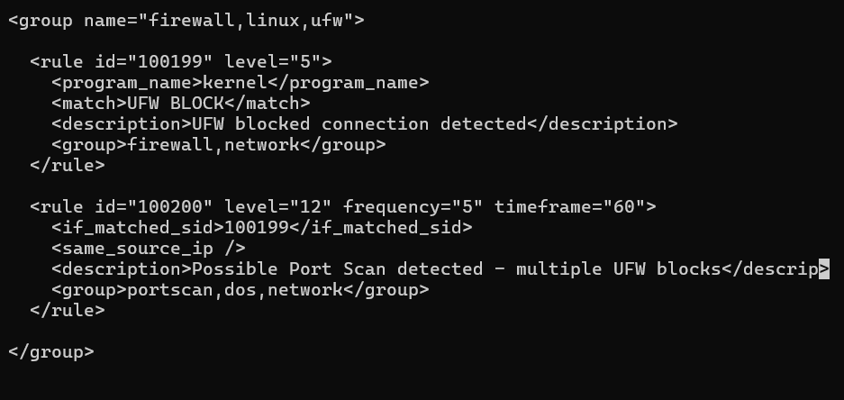

**Response:** rule 100200 triggers `firewall-drop`, blocking the source IP on the agent for 300 seconds.

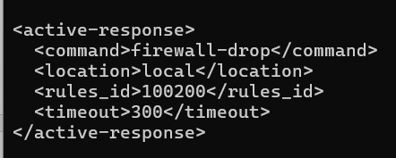

**Validation:** confirmed two ways — `iptables` rule listing on the agent, and the corresponding Wazuh alert.

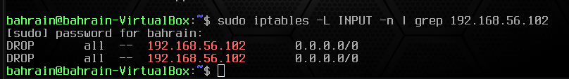

---

## Attack 3 — Malware Detection & Automated Removal (VirusTotal + FIM)

**Setup:** File Integrity Monitoring (`syscheck`) was enabled on the Windows Server agent's Downloads directory. The [EICAR test file](https://en.wikipedia.org/wiki/EICAR_test_file) — a harmless industry-standard file designed to trigger AV detections — was placed there to safely test the full chain.

**Detection chain (fully automated, no manual step between detection and response):**

1. FIM detects the new file → rule **554** fires
2. Wazuh submits the file hash to the **VirusTotal API** automatically
3. VirusTotal flags it as malicious → rule **87105** fires
4. This triggers a custom **Active Response script** (Python, packaged as a Windows `.exe` with PyInstaller) that deletes the file
5. Custom rule **100092** confirms successful removal
6. FIM detects the file is gone → rule **553** fires

```
File added (554) → VirusTotal detection (87105) → Active response executed (100092) → File deleted (553)
```

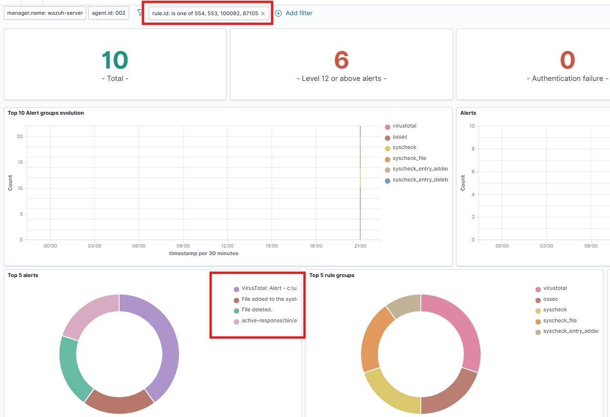

**Response script:** a Python script (compiled to `.exe`) reads the Wazuh alert, extracts the flagged file path, and deletes it — deployed into Wazuh's active-response directory on the Windows agent.

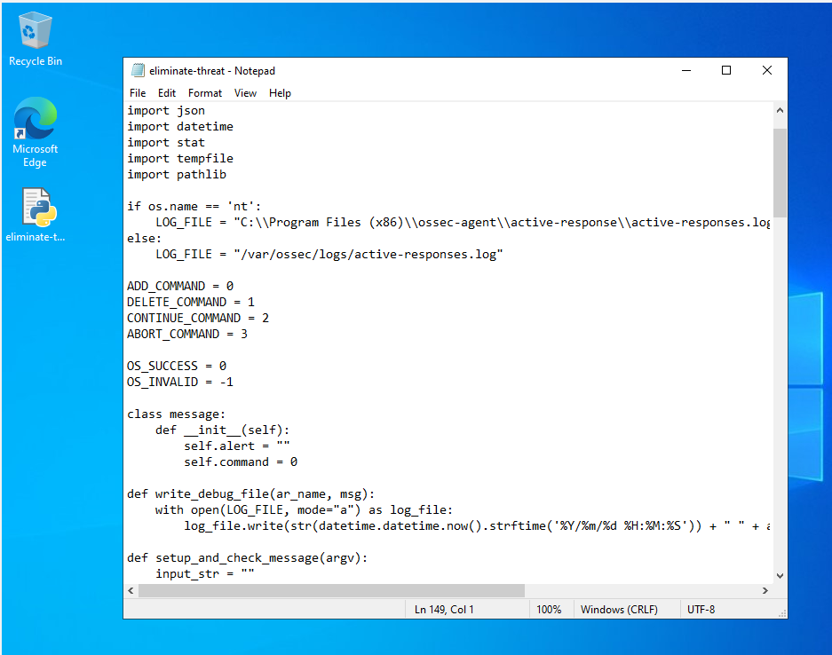

**Validation:** before/after screenshots of the monitored directory confirm the file was automatically removed with no manual intervention.

| Before | After |
|---|---|
| 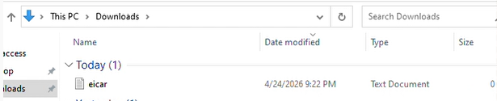 | 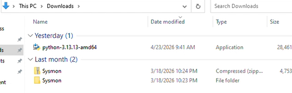 |

---

## Key Takeaways

- Designed detection rules with **escalation thresholds** (frequency + timeframe + same-source-IP) rather than single-event triggers, to keep false-positive rates low while still catching real attack patterns quickly.
- Chained a **threat intelligence API (VirusTotal) directly into an automated response**, going from raw file-system event to verified malicious-file removal with zero manual steps.
- Used Wazuh's built-in active response (`firewall-drop`) alongside a **custom-built Python active response script**, showing both configuration of existing tooling and building bespoke automation where needed.

*All screenshots for each attack (full config steps, raw logs, detailed alerts) are available in the `images/` subfolders.*
