# Task 3: SOAR Automation Using Shuffle

**Part of:** IT8510 Threat Intelligence & Threat Hunting — Group Project (Part B, Task 3)
**My contribution:** Full SOAR pipeline — Shuffle setup, Wazuh webhook integration, VirusTotal enrichment, and automated email response.

> **Note:** a few screenshots contained a live webhook URL, personal email, account name, or student ID and have been redacted before publishing — flagged `-REDACTED` in the filename. The workflow logic and evidence of successful execution are unaffected.

## Objective

Implement Security Orchestration, Automation, and Response (SOAR) using **Shuffle**, integrated with Wazuh: detect a threat, raise an alert, trigger an automated playbook, enrich it with threat intelligence, and execute an automated response — with evidence of the full working chain.

## Architecture

```
Wazuh (FIM detects suspicious file)
   → Webhook alert sent to Shuffle
      → Shuffle enriches file hash via VirusTotal API
         → Automated email notification sent to analyst
```

Environment: a Windows Server running the Wazuh agent, a Wazuh manager (SIEM), and a Shuffle cloud instance for automation — connected via webhook.

## 1. Active Agent Check

Confirmed the Wazuh agent was active and connected on the Windows Server before building anything on top of it.

| | |
|---|---|
| 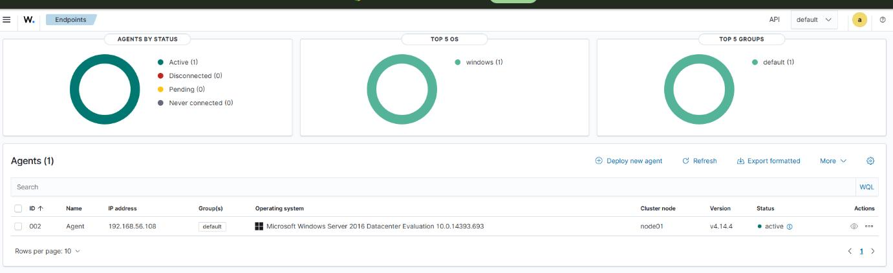 |  |

## 2. File Integrity Monitoring (Detection Trigger)

Wazuh's FIM (`syscheck`) was configured on the Windows agent to monitor the Downloads directory in real time.

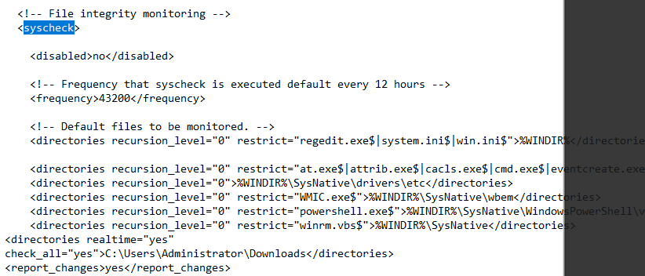

A test file write confirmed FIM fires correctly and produces a real-time alert, before wiring it into the automated pipeline.

| Trigger | Resulting alert |
|---|---|
| 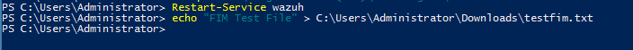 | 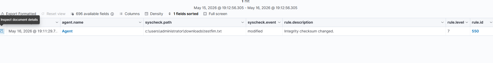 |

Multiple file events (create, modify, delete) were logged correctly by Wazuh:

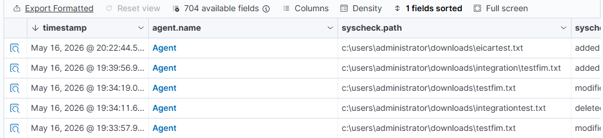

## 3. Shuffle Setup & Workflow Creation

A Shuffle account and workflow were created to receive and process Wazuh alerts — this is the automation canvas the rest of the pipeline runs on.

| Dashboard | New workflow |
|---|---|
| 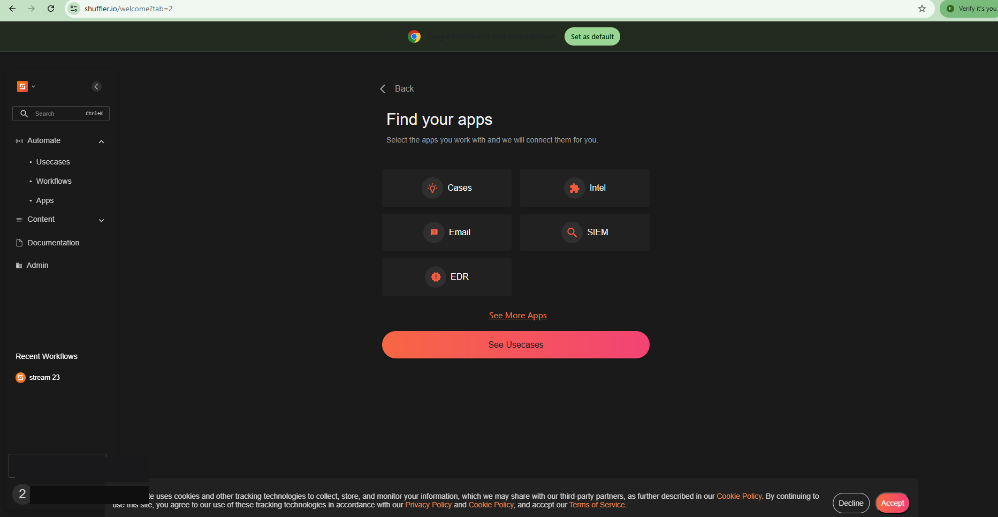 | 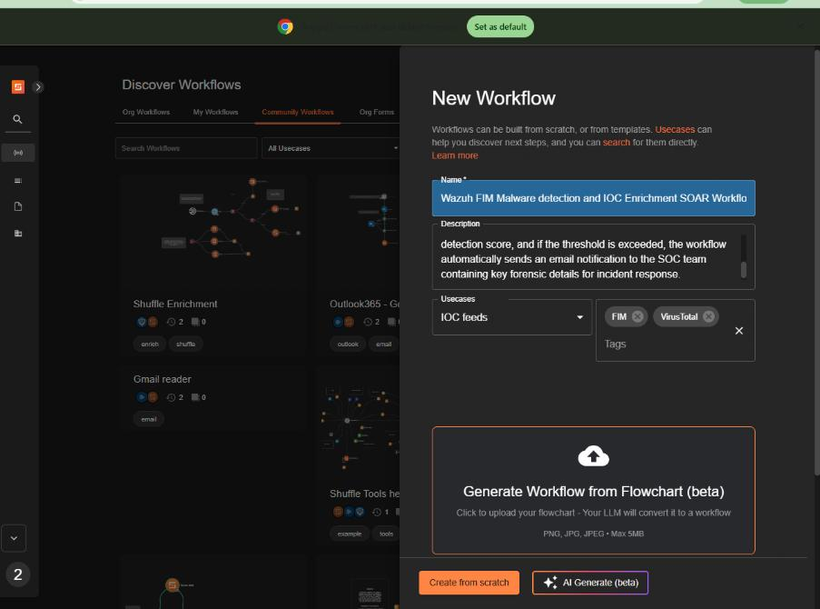 |

## 4. Wazuh → Shuffle Webhook Integration

The Wazuh manager was configured to POST alerts to a Shuffle webhook trigger whenever FIM detects a file event, so alerts flow into the automation pipeline with no manual step.

| Webhook trigger in Shuffle | Wazuh-side XML config |
|---|---|
| 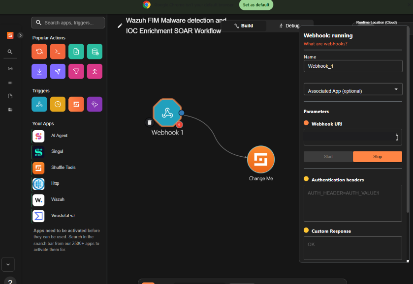 | 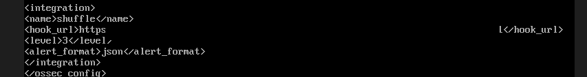 |

The webhook payload was inspected in Shuffle to confirm the full alert context — file path, MD5 hash, rule ID, agent info — arrives correctly for downstream processing.

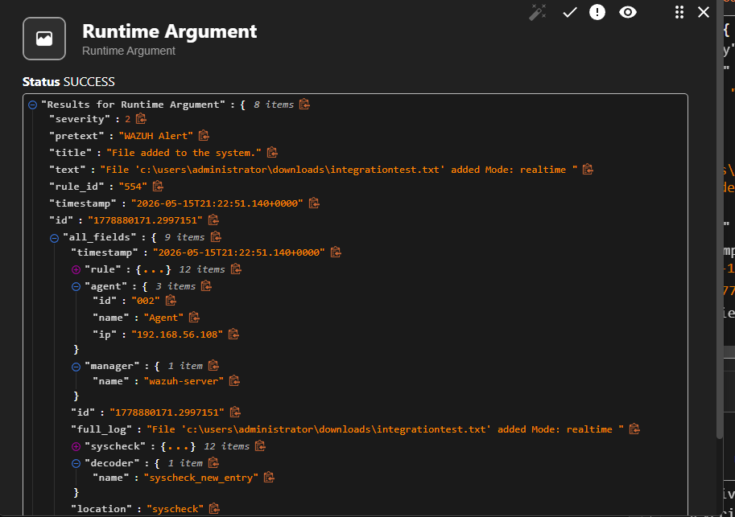

## 5. Workflow Design & Execution

The playbook chains three steps: **webhook trigger → VirusTotal lookup → email notification**.

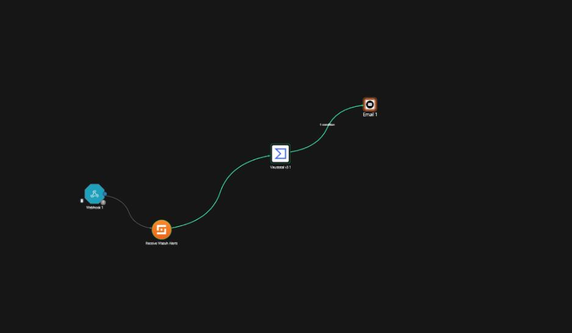

Execution logs confirm the workflow ran successfully and repeatedly in response to real Wazuh alerts.

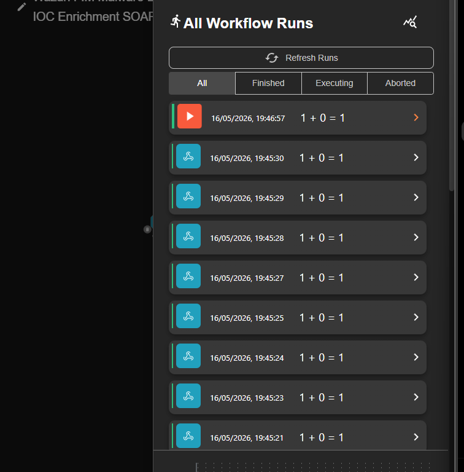

## 6. VirusTotal Threat Intelligence Integration

A VirusTotal account and API key were set up and connected to Shuffle, enabling automatic reputation lookups on file hashes received from Wazuh alerts.

| Account created | API key page |
|---|---|
| 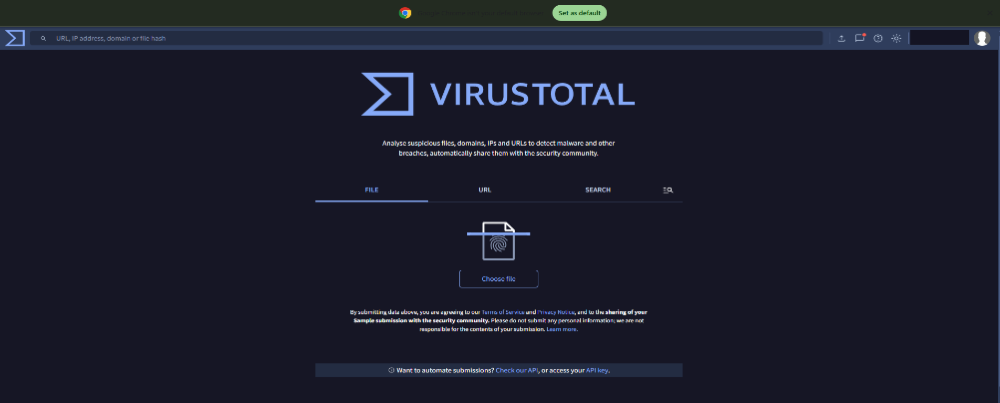 | 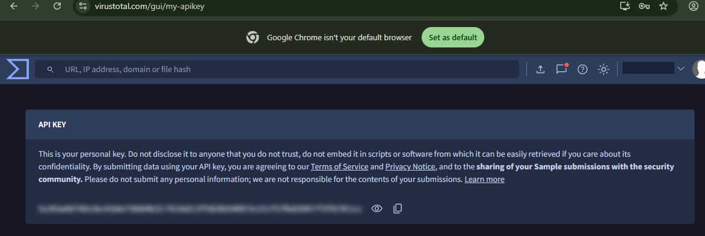 |

The key was entered into Shuffle's VirusTotal integration (masked in the input field), and the lookup action was configured to automatically pull the MD5 hash out of the incoming Wazuh alert (`$exec.all_fields.syscheck.md5_after`) — no manual hash copying.

| Auth config in Shuffle | Hash lookup config |
|---|---|
| 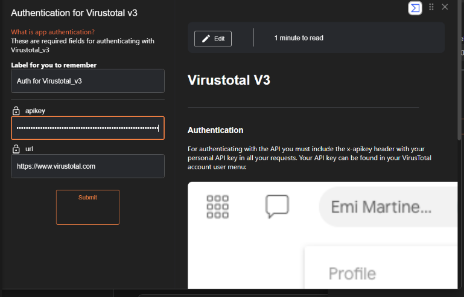 | 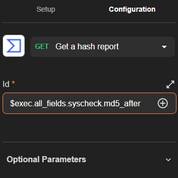 |

## 7. End-to-End Validation (EICAR Test)

The [EICAR test file](https://en.wikipedia.org/wiki/EICAR_test_file) was downloaded into the monitored directory to trigger the full chain safely.

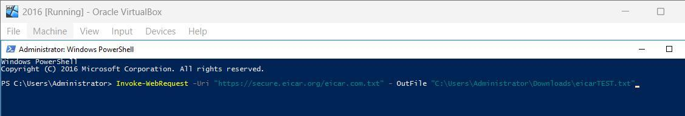

Shuffle's VirusTotal step returned a `200` success response, confirming the hash was received and analyzed.

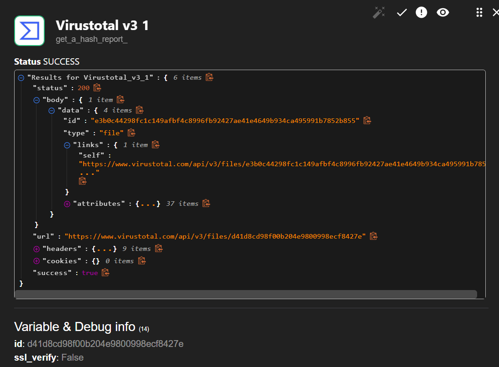

## 8. Automated Response — Email Notification

The final step in the playbook sends an automated email alert containing the file path, MD5 hash, VirusTotal detection count, and timestamp — giving an analyst everything needed to triage without touching any tool manually.

| Notification config | Delivered result |
|---|---|
| 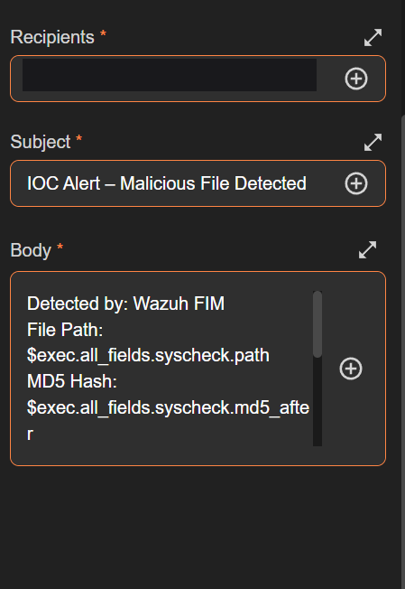 | 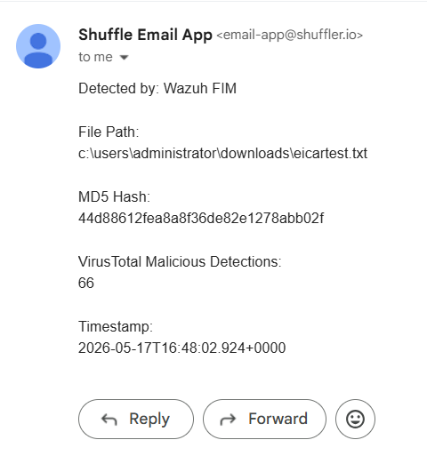 |

The test run confirmed: **66 antivirus engines** flagged the EICAR file as malicious, and the alert email was generated and delivered automatically.

## Key Takeaways

- Built a **fully automated SOAR pipeline** — from raw FIM event to enriched, human-readable alert — with zero manual intervention between detection and notification.
- Used **dynamic variable extraction** (`$exec.all_fields.syscheck.md5_after`) to pass data between playbook steps, rather than hardcoding values, so the workflow generalizes to any file event.
- Validated the pipeline safely using the industry-standard EICAR test file rather than real malware.
